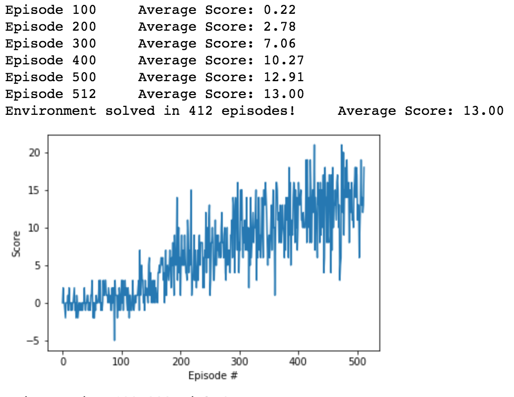

[//]: # (Image References)

[image1]: https://user-images.githubusercontent.com/10624937/42135619-d90f2f28-7d12-11e8-8823-82b970a54d7e.gif "Trained Agent"

# Project 1: Navigation

### Introduction

For this project, I trained an agent to navigate (and collect bananas!) in a large, square world.  

### Code

Navigation.ipynb - contains the code to interact with the environment, calling trained agent and updating overall reward

dqn_agent.py - contains code to train the agent using double dqn method (taken from course)

model.py - contains network used to attain weights (taken from course)

### Learning Algorithm

I implemented double DQN network and this improved by solving the environment in 412 episodes. 

Hyperparameters used for double DQN network are:
- n_episodes=2000
- max_t=1000 
- eps_start=1.0 
- eps_end=0.01 
- eps_decay=0.995
- Tau = 1e-3
- gamma = 0.99
- learning_rate = 5e-4

DQN training agent code can be found in dqn_agent.py file. I changed TD target to get Q_target value for maximum reward action from Q_local to implement Double DQN.

Two fully connected layers with 'relu' activation neural network architecture is used for the model which can be found in model.py file.

### Plot

Below is a plot of rewards per episode for traing which illustrates that the agent is able to receive an average reward (over 100 episodes) of at least +13.

 

### Ideas for future work

To improve the agent, I would like to try Dueling and Prioritized Experience Replay methods.